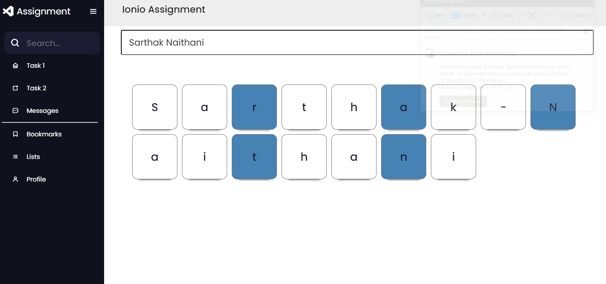
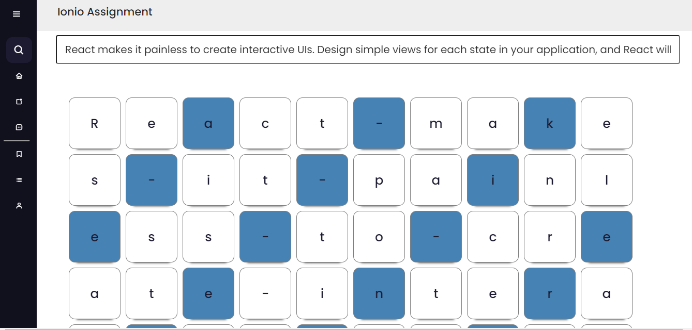
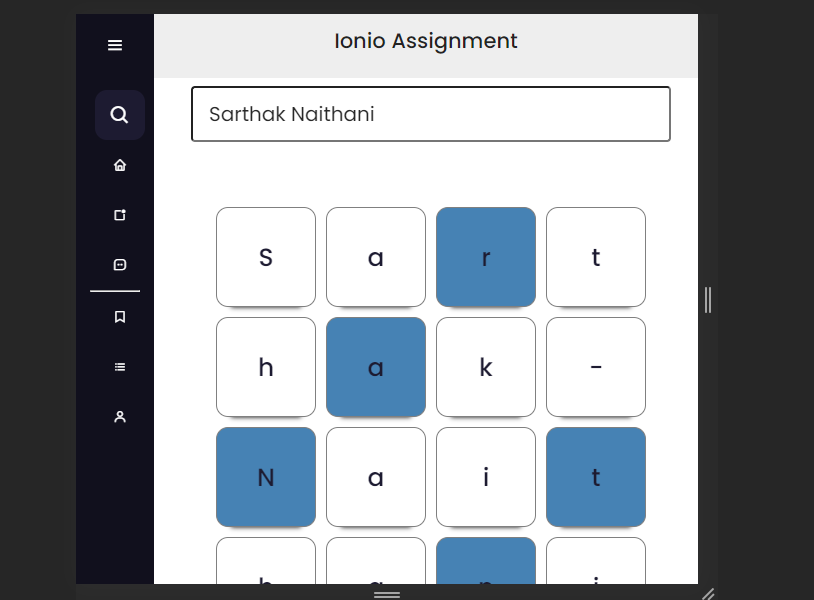
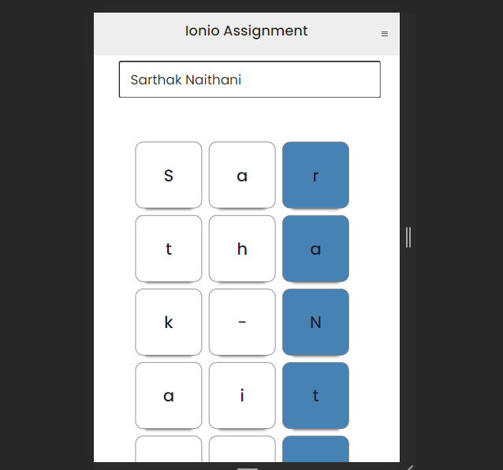
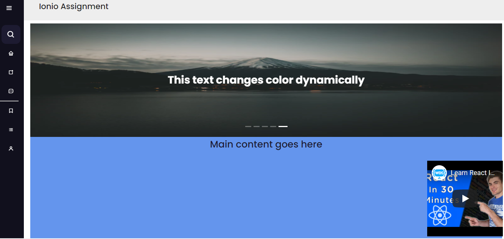
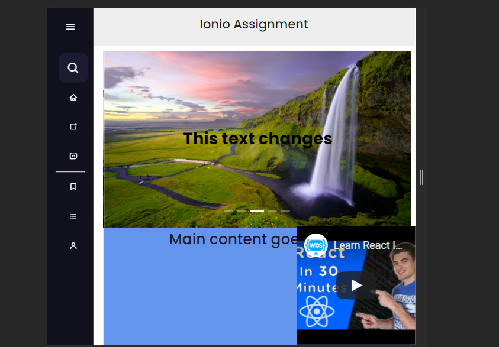

# React Assignment

  
   

  
   

   
  

## Description
Both the Tasks uses React for frontend and is responsive for desktop as well as mobile devices.

### Task 1
- This application takes an string as an input and generates a card display for each character in a string iwth every 3 card color different then the others.
- It is implemented using React, with no other extra libraries

### Task 2
- Task 2 uses react-color-extractor to extract the most dominant colors from the background color and then the brightness value of the color is calculated and then the text color is changed accordingly.
- Card carousal uses Ant design library.

## Setup locally

    $ npm install
    $ npm start